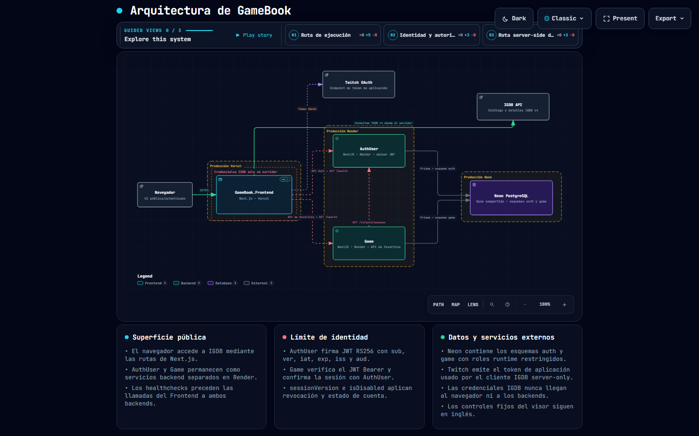

# GameBook.System

[Leer esta documentación en inglés](README.md)

Este README es el único documento general en español del repositorio exclusivamente documental. Describe la implementación presente en la rama `main` de los tres repositorios de aplicaciones cuando se preparó el área de staging documental el 2026-09-29. Es un registro de la implementación y no reemplaza los requisitos originales. Los archivos SDD de `specs/`, `plan/` y `tasks/` permanecen como registro histórico de trazabilidad.

## 1. Propósito y alcance

GameBook es un sistema web pequeño para un portfolio personal, orientado al descubrimiento de videojuegos y a la gestión de una lista personal de favoritos. Las personas visitantes pueden consultar un catálogo público respaldado por IGDB sin crear una cuenta. Las personas autenticadas pueden registrarse, iniciar sesión, mantener una sesión, filtrar y paginar sus favoritos, guardar o quitar juegos, consultar detalles, cambiar su contraseña y deshabilitar lógicamente su cuenta.

La topología productiva está formada por tres repositorios públicos e independientes:

| Componente | Responsabilidad | Implementación principal |
| --- | --- | --- |
| [`GameBook.Frontend`](https://github.com/CarlosSV923/GameBook.Frontend) | Experiencia del navegador, UI de cuenta y sesión, catálogo, favoritos y proxy de IGDB en el servidor | Next.js, React, TypeScript, Axios, RxJS |
| [`GameBook.Microservice.AuthUser`](https://github.com/CarlosSV923/GameBook.Microservice.AuthUser) | Registro, inicio de sesión, validación de sesión, cambio de contraseña, firma de JWT y deshabilitación lógica de cuentas | NestJS, TypeScript, Prisma, PostgreSQL |
| [`GameBook.Microservice.Game`](https://github.com/CarlosSV923/GameBook.Microservice.Game) | Persistencia, filtrado, sugerencias y actualización de instantáneas de favoritos | NestJS, TypeScript, Prisma, PostgreSQL |

Los servicios comparten un despliegue de PostgreSQL, pero utilizan esquemas de base de datos separados. El navegador nunca recibe las credenciales de aplicación de IGDB/Twitch.

## 2. Arquitectura implementada

El artefacto Archify validado en español para la topología final de las aplicaciones se conserva en [`architecture/`](architecture/):

- [Diagrama de arquitectura](https://carlossv923.github.io/GameBook.System/GameBook.System-architecture-es.html)

El diagrama muestra el frontend, AuthUser, Game, Neon/PostgreSQL, OAuth de Twitch, IGDB, la validación de JWT/sesión y las relaciones principales entre ellos. Las etiquetas propias están traducidas al español; los controles fijos del visor Archify permanecen en inglés.

En tiempo de ejecución el sistema está organizado alrededor de cuatro límites cooperantes:

1. El navegador renderiza la aplicación Next.js y conserva el token de acceso de GameBook en `sessionStorage`.
2. Next.js expone rutas de servidor bajo `/api/igdb/*` y utiliza credenciales exclusivas del servidor para obtener un token de aplicación de Twitch y llamar a IGDB.
3. AuthUser es dueño del esquema `auth`, firma JWT RS256 y es la autoridad para la identidad de usuario y la validez persistida de las sesiones.
4. Game es dueño del esquema `game`, verifica localmente el JWT, solicita a AuthUser validar la sesión y persiste los favoritos usando el UUID del token validado.

## 3. Flujos principales de usuario

### 3.1 Catálogo público

1. Una persona visitante abre la página principal de Next.js.
2. El navegador llama a la ruta local del frontend `/api/igdb/games`.
3. El cliente de IGDB del servidor obtiene o reutiliza un token de aplicación de Twitch.
4. El servidor llama a IGDB, adapta la respuesta del proveedor al contrato del frontend y devuelve las tarjetas del catálogo.
5. Los filtros de nombre, plataforma y año de lanzamiento se envían como parámetros de consulta. La paginación usa `limit` y `offset`.
6. El adaptador descarta registros incompletos cuando la tarjeta no tendría un valor requerido visible, como portada, fecha de lanzamiento, valoración o plataforma.

El navegador no llama directamente a IGDB ni a Twitch. El detalle, las sugerencias de nombres de juegos y las sugerencias de plataformas utilizan sus respectivas rutas de Next.js. Los fallos del proveedor se transforman en códigos de error estables del frontend sin exponer credenciales ni detalles internos sin procesar.

### 3.2 Registro e inicio de sesión

1. El navegador solicita al cliente AuthUser una comprobación de disponibilidad mediante `GET /health`.
2. Cuando AuthUser responde con HTTP `200`, el cliente envía `POST /v1/auth/register` o `POST /v1/auth/login`.
3. AuthUser valida la solicitud, lee o escribe el usuario en el esquema `auth` y devuelve la respuesta documentada.
4. Durante el inicio de sesión, AuthUser firma un JWT RS256 que contiene el UUID del usuario, la versión de sesión, emisor, audiencia, momento de emisión y expiración de una hora.
5. El frontend guarda el token en `sessionStorage` y lo valida mediante `GET /v1/auth/session` antes de considerar autenticada la sesión.

Las cuentas deshabilitadas son rechazadas en el inicio de sesión con `ACCOUNT_DISABLED`. El registro con un correo deshabilitado se rechaza con el mismo código semántico. El frontend considera descartables las sesiones revocadas, expiradas, inválidas o deshabilitadas y elimina el token almacenado.

### 3.3 Favoritos

1. Una persona con sesión abre el catálogo o la vista de favoritos.
2. Antes de cada operación de AuthUser o Game, el cliente correspondiente del frontend ejecuta la comprobación de disponibilidad del servicio.
3. El frontend envía `Authorization: Bearer <token>` a Game.
4. Game verifica localmente la firma RS256 y las declaraciones de emisor, audiencia, expiración y UUID.
5. Game llama al endpoint de sesión actual de AuthUser para confirmar que la versión persistida de la sesión sigue siendo válida y que la cuenta no está deshabilitada.
6. Game utiliza el UUID validado como clave de propiedad. Nunca acepta un ID de usuario enviado por el cliente para determinar la propiedad del favorito.
7. Prisma lee o escribe en el esquema `game`. Los filtros por nombre, plataforma y rango de años de lanzamiento se combinan con semántica AND.

La creación, actualización de instantánea y eliminación son mutaciones explícitas. Las operaciones de listado y sugerencias devuelven únicamente registros del sujeto autenticado. Una sesión revocada o deshabilitada se rechaza antes de ejecutar el caso de uso de favoritos.

### 3.4 Cambio de contraseña y deshabilitación de cuenta

`PATCH /v1/users/me/password` valida la contraseña actual y la política de la nueva contraseña. El reemplazo del hash incrementa `sessionVersion` de forma atómica, lo que invalida todos los JWT emitidos anteriormente, incluido el token utilizado para la solicitud. El frontend limpia la sesión y solicita que la persona inicie sesión nuevamente.

`DELETE /v1/users/me` es una operación de deshabilitación lógica. Establece `isDisabled` en `true`, incrementa `sessionVersion`, conserva el usuario y sus favoritos e invalida los tokens existentes. El MVP no incluye reactivación ni purga física de datos.

## 4. Límites de implementación

### 4.1 Frontend

El App Router de Next.js separa la composición de páginas, el comportamiento de funcionalidades, los tipos de API compartidos y la integración con proveedores exclusiva del servidor:

- `src/app/` contiene las páginas y los manejadores de rutas `/api/igdb/*`.
- `src/features/api/` contiene los clientes tipados de AuthUser, Game y las rutas de IGDB del frontend.
- `src/features/auth/`, `catalog/`, `favorites/`, `profile/` y `preferences/` contienen el comportamiento visible para la persona usuaria.
- `src/shared/api/` contiene el transporte Axios, los pipelines RxJS, los contratos, errores, healthchecks y mocks.
- `src/server/igdb/` contiene los clientes server-only de Twitch/IGDB, el mapeo de consultas, la validación de respuestas, la limitación de solicitudes y el mapeo de errores del proveedor.

La capa HTTP compartida usa Axios para las solicitudes y RxJS para componer los pipelines observables. Las solicitudes GET normales pueden reintentar fallos transitorios dos veces con pausas breves. Las mutaciones no utilizan esa política genérica de reintento. Los clientes de AuthUser y Game deshabilitan los reintentos genéricos de la operación y esperan primero a su healthcheck.

El pipeline de healthcheck usa `GET /health`, espera hasta 15 segundos por intento y permite 15 reintentos adicionales. El primer intento fallido puede mostrar la alerta bilingüe de espera por activación de Render; una recuperación con HTTP `200` la cierra antes de su tiempo normal. Una solicitud cancelada detiene el pipeline observable sin iniciar la operación protegida.

Evidencia relevante: [`auth-user-client.ts`](https://github.com/CarlosSV923/GameBook.Frontend/blob/main/src/features/api/auth-user-client.ts), [`game-client.ts`](https://github.com/CarlosSV923/GameBook.Frontend/blob/main/src/features/api/game-client.ts), [`healthcheck.ts`](https://github.com/CarlosSV923/GameBook.Frontend/blob/main/src/shared/api/healthcheck.ts) y [`http.ts`](https://github.com/CarlosSV923/GameBook.Frontend/blob/main/src/shared/api/http.ts).

### 4.2 AuthUser

AuthUser sigue una estructura NestJS orientada a DDD:

- `src/api/` contiene controladores, DTOs de solicitud, validación, CORS, IDs de solicitud, mapeo de excepciones, health y Swagger/OpenAPI.
- `src/application/` contiene casos de uso, puertos, tokens de dependencias y límites de contraseñas y JWT.
- `src/domain/` contiene el agregado `User`, el objeto de valor de correo, la política de contraseñas y errores de dominio.
- `src/infrastructure/` contiene configuración de runtime, criptografía RS256, hashing de contraseñas con scrypt y persistencia Prisma.

El modelo de persistencia incluye el UUID de usuario, los campos de identidad, el hash de contraseña, `sessionVersion` e `isDisabled`. Las migraciones Prisma están separadas del arranque de runtime y se ejecutan mediante el workflow de migraciones dedicado, con credenciales exclusivas para migración. El acceso de runtime utiliza el rol del esquema de AuthUser.

AuthUser expone `GET /health`, `POST /v1/auth/register`, `POST /v1/auth/login`, `GET /v1/auth/session`, `PATCH /v1/users/me/password` y `DELETE /v1/users/me`. Swagger UI y su documento JSON están disponibles en `/docs` y `/docs/openapi.json`.

Evidencia relevante: [`api.module.ts`](https://github.com/CarlosSV923/GameBook.Microservice.AuthUser/blob/main/src/api/api.module.ts), [`login-user.ts`](https://github.com/CarlosSV923/GameBook.Microservice.AuthUser/blob/main/src/application/use-cases/login-user.ts), [`validate-session.ts`](https://github.com/CarlosSV923/GameBook.Microservice.AuthUser/blob/main/src/application/use-cases/validate-session.ts) y [`schema.prisma`](https://github.com/CarlosSV923/GameBook.Microservice.AuthUser/blob/main/src/infrastructure/persistence/prisma/schema.prisma).

### 4.3 Game

Game utiliza los mismos límites principales de NestJS:

- `src/api/` contiene controladores de favoritos, validación de DTOs, guard JWT, CORS, IDs de solicitud, mapeo de excepciones, health y Swagger/OpenAPI.
- `src/application/` contiene casos de uso y puertos de favoritos.
- `src/domain/` contiene el agregado `Favorite`, el comportamiento de valor de plataforma, el puerto del repositorio y errores de validación de dominio.
- `src/infrastructure/` contiene el cliente de sesión de AuthUser, la verificación RS256, la configuración de runtime, el cliente Prisma y el repositorio de favoritos.

Game expone `GET /health`, `GET /v1/favorites`, `GET /v1/favorites/suggestions`, `POST /v1/favorites`, `PATCH /v1/favorites/:igdbId/snapshot` y `DELETE /v1/favorites/:igdbId`. Las rutas protegidas declaran seguridad Bearer JWT en OpenAPI. Si AuthUser no puede ser contactado, Game devuelve `503` sin ejecutar el caso de uso de favoritos.

El modelo Prisma utiliza una clave compuesta `(userId, igdbId)` para los favoritos y una tabla relacionada de plataformas. Ambas tablas están asignadas explícitamente al esquema PostgreSQL `game`. El workflow de migraciones utiliza una variable de base de datos exclusiva para migración y no ejecuta migraciones durante el build o el arranque de la aplicación.

Evidencia relevante: [`favorites.controller.ts`](https://github.com/CarlosSV923/GameBook.Microservice.Game/blob/main/src/api/favorites/favorites.controller.ts), [`jwt-auth-guard.ts`](https://github.com/CarlosSV923/GameBook.Microservice.Game/blob/main/src/api/auth/jwt-auth-guard.ts), [`auth-user-session-client.ts`](https://github.com/CarlosSV923/GameBook.Microservice.Game/blob/main/src/infrastructure/auth/auth-user-session-client.ts) y [`schema.prisma`](https://github.com/CarlosSV923/GameBook.Microservice.Game/blob/main/src/infrastructure/persistence/prisma/schema.prisma).

## 5. Modelo de API y seguridad

Los dos servicios NestJS exponen Swagger UI y el JSON OpenAPI sin autenticación para que los contratos del portfolio puedan consultarse. Las operaciones protegidas declaran seguridad HTTP Bearer JWT. CORS acepta únicamente la lista de orígenes configurada; el constructor de opciones de runtime descarta los orígenes comodín.

AuthUser firma JWT con RS256. Game recibe la clave pública correspondiente y comprueba de forma independiente el algoritmo, la firma, el sujeto UUID, la declaración de versión de sesión, el emisor, la audiencia y la expiración. Después Game solicita a AuthUser validar la versión persistida de la sesión y el estado de deshabilitación. Esta comprobación en dos pasos permite que Game rechace tokens criptográficamente válidos pero revocados o pertenecientes a una cuenta deshabilitada.

Las contraseñas se hashean y nunca se devuelven. Las claves privadas, valores públicos de producción, URLs de base de datos, secretos OAuth, tokens de acceso y credenciales reales se administran mediante variables de entorno y no forman parte de esta instantánea documental.

## 6. Pruebas y observabilidad

Los tres repositorios utilizan `pnpm` e incluyen pruebas automatizadas:

- Las pruebas unitarias del frontend cubren clientes de API, reintentos Axios/RxJS, timeout y recuperación de healthcheck, estado del catálogo y favoritos, autenticación, localización, preferencias y estados de UI.
- Las pruebas unitarias y de integración de AuthUser cubren reglas de dominio, configuración, criptografía, registro, inicio de sesión, validación de sesión, cambio de contraseña, deshabilitación lógica, acceso Prisma, CORS, IDs de solicitud y comportamiento de OpenAPI/bootstrap.
- Las pruebas unitarias y de integración de Game cubren el dominio y los casos de uso de favoritos, persistencia Prisma, verificación JWT, fallos de sesión de AuthUser, aislamiento de propiedad, revocación, healthcheck, OpenAPI y comportamiento HTTP.

Los repositorios mantienen los workflows de CI, release-please y migraciones bajo `.github/workflows/`. El pipeline de solicitudes de backend añade un ID de solicitud, valida la entrada, mapea los errores conocidos a respuestas contractuales y registra la finalización de cada solicitud. Los logs deben ser legibles y correlacionables sin incluir contraseñas, JWT, claves privadas, API keys ni credenciales de base de datos.

## 7. Despliegue y configuración de runtime

Los servicios productivos se configuran fuera de los repositorios de aplicación:

- Frontend: [Vercel](https://gamebook-frontend.vercel.app/), construido desde `main`.
- AuthUser: [Swagger de Render](https://gamebook-microservice-authuser.onrender.com/docs), construido desde `main`.
- Game: [Swagger de Render](https://gamebook-microservice-game.onrender.com/docs), construido desde `main`.
- PostgreSQL: entornos Neon con esquemas `auth` y `game` y credenciales separadas por entorno.
- Proveedor: OAuth de aplicación de Twitch obtiene el token utilizado por el adaptador server-only de IGDB.

La documentación de los servicios productivos está disponible en [Swagger de AuthUser](https://gamebook-microservice-authuser.onrender.com/docs), [OpenAPI de AuthUser](https://gamebook-microservice-authuser.onrender.com/docs/openapi.json), [Swagger de Game](https://gamebook-microservice-game.onrender.com/docs) y [OpenAPI de Game](https://gamebook-microservice-game.onrender.com/docs/openapi.json).

Las variables de runtime son proporcionadas por los entornos de hosting. Las URLs directas de base de datos usadas por los workflows de migración Prisma no son variables de runtime y no se configuran en Render ni Vercel. El frontend mantiene `IGDB_CLIENT_ID` e `IGDB_CLIENT_SECRET` únicamente en el servidor; las URLs de los servicios son los únicos valores de configuración públicos del frontend.

## 8. Historial de releases

Cada repositorio de aplicación utiliza release-please para gestionar sus releases versionados de forma independiente. `GameBook.System` es solo documental y no utiliza release-please, `pnpm`, Vercel ni una rama `develop`.

| Repositorio | Releases | Rol productivo |
| --- | --- | --- |
| GameBook.Frontend | [Ver releases](https://github.com/CarlosSV923/GameBook.Frontend/releases) | Frontend Vercel |
| GameBook.Microservice.AuthUser | [Ver releases](https://github.com/CarlosSV923/GameBook.Microservice.AuthUser/releases) | Servicio de identidad Render |
| GameBook.Microservice.Game | [Ver releases](https://github.com/CarlosSV923/GameBook.Microservice.Game/releases) | Servicio de favoritos Render |

## 9. Limitaciones deliberadas

- El MVP no traduce los títulos, descripciones, géneros ni nombres de plataformas devueltos por IGDB.
- La deshabilitación de cuenta es lógica e irreversible desde la UI actual; la cuenta y sus favoritos se conservan y no existe un flujo de reactivación.
- Game depende de AuthUser para validar la sesión persistida, por lo que la indisponibilidad de AuthUser bloquea las operaciones protegidas de Game aunque el JWT esté bien formado.
- AuthUser y Game funcionan en el plan gratuito de Render. Cuando esos servicios backend permanecen inactivos, Render puede suspenderlos y la siguiente solicitud puede tardar más mientras vuelven a activarse; la espera del healthcheck, los reintentos y el mensaje de activación del frontend hacen más clara esa espera, pero no pueden eliminar la latencia de arranque del proveedor.
- La disponibilidad de IGDB, la validez del token OAuth, los límites del proveedor y el contrato de API local del frontend siguen siendo límites externos de fallo.
- El sistema está dividido intencionalmente en repositorios independientes y no en un paquete compartido o monorepo.

## 10. Fuentes de trazabilidad

El registro de implementación se apoya en los directorios `contracts/`, `environments/`, `specs/`, `plan/` y `tasks/` del staging, en los tres repositorios públicos de aplicación y en los artefactos Archify validados de `architecture/`.

| Área | Referencia | Propósito |
| --- | --- | --- |
| Especificación | [Especificación del MVP](specs/mvp.md) | Requisitos SDD originales y alcance de aceptación. |
| Plan | [Plan del MVP](plan/mvp.md) | Estrategia original de implementación y puertas de calidad. |
| Tareas | [Registro de tareas del MVP](tasks/mvp.md) | Estado coordinado de ejecución y evidencia. |
| Contratos | [Línea base de contratos v3](contracts/contract-baseline-v3.md) | Contrato vigente; los documentos anteriores se conservan como trazabilidad histórica. |
| Ambientes | [Política de despliegue local-first](environments/deployment-policy-local-first.md) | Política vigente de ambientes y despliegue. |
| Instrucciones del proyecto | [AGENTS.md](AGENTS.md) y [CLAUDE.md](CLAUDE.md) | Instrucciones operativas preservadas en español. |

Los documentos SDD, contratos, ambientes e instrucciones del proyecto existentes se mantienen en español conforme a la decisión documentada en GB-014.03. Este README es el único documento general en español del repositorio; su versión completa en inglés es [README.md](README.md).
